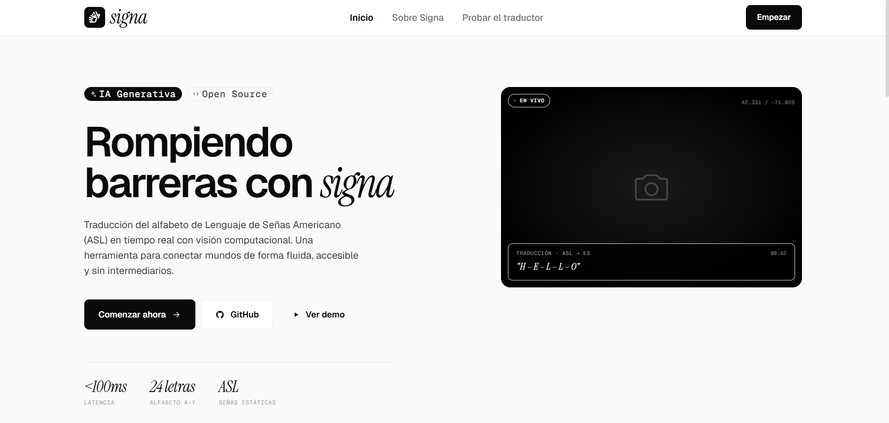
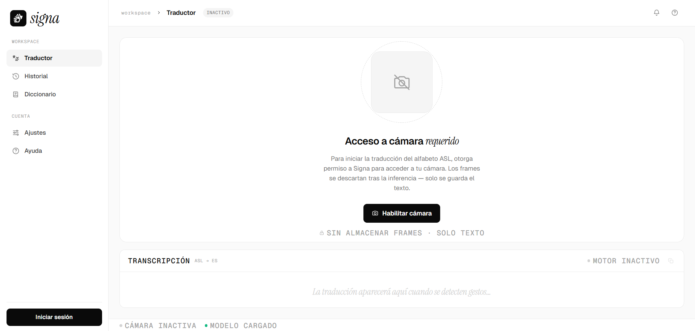

# Sistema de Traducción de Lenguaje de Señas en Tiempo Real

Traductor de Lenguaje de Señas ASL en tiempo real mediante webcam. El frontend captura frames, los envía al backend Spring Boot, y el servicio de IA extrae landmarks con MediaPipe y clasifica la seña con una red neuronal densa (97 % de accuracy en el set de validación).


## Demo

<p align="center">
  
</p>

> Reconocimiento de letras ASL desde la webcam con extracción de landmarks y composición de palabras en tiempo real.

---

## Tabla de Contenidos

- [Screenshots](#screenshots)
- [Arquitectura](#arquitectura)
- [Inicio Rápido con Docker](#inicio-rápido-con-docker)
- [Endpoints](#endpoints)
- [Tecnologías](#tecnologías)
- [Estado del Proyecto](#estado-del-proyecto)
- [Entrenamiento del Modelo](#entrenamiento-del-modelo)

---

## Screenshots

| Landing | Traductor |
|:---:|:---:|
|  |  |
| Página de inicio del producto | Detección de seña en vivo |

---

## Arquitectura

| Servicio | Carpeta | Puerto |
|---|---|---|
| Frontend (React + Vite → nginx) | `frontend-react/` | 80 |
| Backend (Spring Boot) | `backend-springboot/` | 8080 |
| AI Service (FastAPI) | `ai-service-python/` | 8000 |

---

## Inicio Rápido con Docker

### Requisitos
- [Docker Desktop](https://docs.docker.com/get-docker/) con Docker Compose incluido.

### Levantar el stack completo

```bash
git clone https://github.com/KawKuroi/Sign_Language_Translator.git
cd Sign_Language_Translator
docker compose up --build
```

> El flag `--build` fuerza la compilación de imágenes. En builds posteriores sin cambios puedes omitirlo.

Una vez arriba:

| Servicio | URL |
|---|---|
| Frontend (UI) | http://localhost |
| Backend API | http://localhost:8080 |
| AI Service + Swagger | http://localhost:8000/docs |

```bash
docker compose down   # detiene y elimina los contenedores
```

---

## Endpoints

<details>
<summary><b>Backend</b> — Traducción, autenticación e historial</summary>

### `POST /translate` (público)

```json
// Body
{ "image": "data:image/jpeg;base64,..." }

// Respuesta 200
{ "handFound": true, "letter": "A", "confidence": 0.97, "top": [...] }
```

### Autenticación (pública)

| Método | Ruta | Descripción |
|---|---|---|
| `POST` | `/auth/register` | Registro. Body: `{ "email", "password" }`. Devuelve `{ "token", "email" }` |
| `POST` | `/auth/login` | Login con los mismos campos. Devuelve JWT. |

### Historial (requiere `Authorization: Bearer <token>`)

| Método | Ruta | Descripción |
|---|---|---|
| `POST` | `/history` | Guarda texto de la sesión. Body: `{ "text": "HELLO WORLD" }` |
| `GET` | `/history` | Historial del usuario (más reciente primero) |

</details>

<details>
<summary><b>AI Service</b> — Inferencia directa</summary>

### `POST /predict`

```json
// Body
{ "image": "data:image/jpeg;base64,..." }   // también acepta base64 puro sin prefijo

// Con mano detectada
{ "hand_found": true, "letter": "A", "confidence": 0.97, "top": [...] }

// Sin mano
{ "hand_found": false, "letter": null, "confidence": 0.0, "top": [] }
```

Letras soportadas: **A–Y** (J y Z excluidas por requerir movimiento).

</details>

---

## Tecnologías

| Capa | Stack |
|---|---|
| Frontend | React 18, TypeScript, Vite, Tailwind CSS 3, react-webcam, nginx:alpine |
| Backend | Java 17, Spring Boot 3.1, Spring Security 6, JWT (jjwt), H2, Maven |
| AI Service | Python 3.10, FastAPI, MediaPipe, ai-edge-litert (TFLite runtime), OpenCV, NumPy |
| Infraestructura | Docker, Docker Compose |

### Tamaños de imágenes Docker (aproximados)

| Imagen | Tamaño |
|---|---|
| Frontend | ~25 MB |
| Backend | ~300 MB |
| AI Service | ~1.5–2 GB |

---

## Estado del Proyecto

| Servicio | Stack principal | Tests | Detalle |
|---|---|---|---|
| **Frontend** | React 18 + Tailwind CSS 3, design system Signa | 50 / 50 | [frontend-react/README.md](frontend-react/README.md) |
| **Backend** | Spring Boot 3.1 + JWT + H2 | 25 / 25 | [backend-springboot/README.md](backend-springboot/README.md) |
| **AI Service** | FastAPI + MediaPipe + TFLite | 5 / 5 | [ai-service-python/README.md](ai-service-python/README.md) |

Pipeline end-to-end funcional: webcam → captura cada 2 s → landmarks → red densa → letra reconocida → historial persistente por usuario.

---

## Entrenamiento del Modelo

El modelo fue entrenado en Google Colab. El notebook contiene el flujo completo: extracción de landmarks con MediaPipe y entrenamiento de la red densa.

**[Ver Notebook en Google Colab](https://colab.research.google.com/drive/1qajMkPVaFqv2pbhziVAZPs_v8tdftteS)**

El modelo se distribuye como `asl_model.keras` en el repo. Durante el build de Docker se convierte automáticamente a formato TFLite (`asl_model.tflite`) para no requerir TensorFlow en la imagen de producción.
