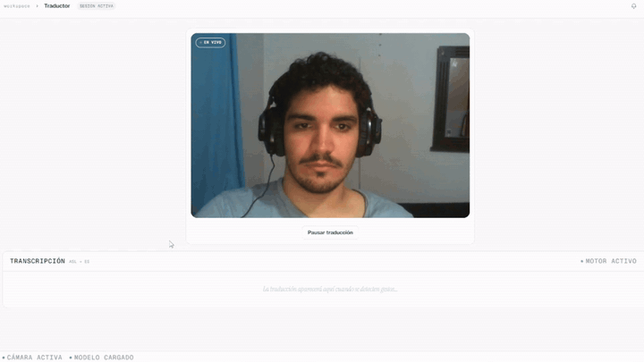

# Sistema de Traducción de Lenguaje de Señas en Tiempo Real

Traductor de lenguaje de señas ASL (A–Y) en tiempo real mediante webcam. Captura frames en el browser, los envía a un gateway Spring Boot, y el servicio de IA extrae landmarks con MediaPipe y clasifica la seña con una red neuronal densa (97 % de accuracy).


## Demo

<p align="center">
  
</p>

---

## Inicio Rápido

```bash
git clone https://github.com/KawKuroi/Sign_Language_Translator.git
cd Sign_Language_Translator
docker compose up --build
```

| Servicio | URL |
|---|---|
| Frontend | http://localhost |
| Backend API | http://localhost:8080 |
| AI Service + Swagger | http://localhost:8000/docs |

```bash
docker compose down
```

---

## Arquitectura

| Servicio | Carpeta | Puerto | Tests |
|---|---|---|---|
| Frontend (React + Vite → nginx) | `frontend-react/` | 80 | 50 / 50 |
| Backend (Spring Boot) | `backend-springboot/` | 8080 | 25 / 25 |
| AI Service (FastAPI) | `ai-service-python/` | 8000 | 5 / 5 |

Pipeline: webcam → frame cada 2 s → Spring Boot → MediaPipe (21 landmarks) → red densa (256→128→64→24) → letra + confianza → historial por usuario.

---

## Stack

| Capa | Tecnologías |
|---|---|
| Frontend | React 18, TypeScript, Vite, Tailwind CSS 3, react-webcam, nginx:alpine |
| Backend | Java 17, Spring Boot 3.1, Spring Security 6, JWT (jjwt), H2, Maven |
| AI Service | Python 3.10, FastAPI, MediaPipe, TFLite (ai-edge-litert), OpenCV, NumPy |
| Infraestructura | Docker, Docker Compose |

---

## API

La documentación interactiva completa está disponible en **http://localhost:8000/docs** (Swagger UI).

| Ruta | Acceso | Descripción |
|---|---|---|
| `POST /translate` | Público | Recibe imagen base64, devuelve letra y confianza |
| `POST /auth/register` | Público | Registro de usuario, devuelve JWT |
| `POST /auth/login` | Público | Login, devuelve JWT |
| `POST /history` | Bearer token | Guarda texto de la sesión |
| `GET /history` | Bearer token | Historial del usuario |

---

## Modelo

Entrenado en Google Colab con extracción de landmarks MediaPipe y red densa. Se distribuye como `asl_model.keras`; el build de Docker lo convierte a TFLite automáticamente. Letras soportadas: **A–Y** (J y Z excluidas por requerir movimiento).

**[Ver Notebook en Google Colab](https://colab.research.google.com/drive/1qajMkPVaFqv2pbhziVAZPs_v8tdftteS)**
